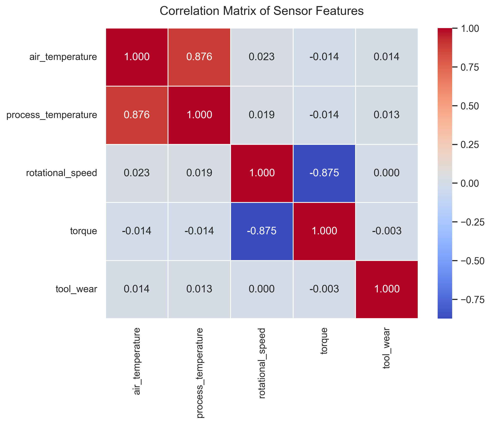

# 🏭 Industrial Failure Prediction: Predictive Maintenance with Machine Learning

> [!NOTE]
> **Tech Stack Core:** Python | Scikit-Learn | XGBoost


This repository contains a two-part end-to-end Machine Learning study to predict catastrophic failures in an industrial machining process (CNC milling machine/lathe) using the **AI4I 2020 Predictive Maintenance Dataset**.

The core value of this project lies in fusing **mechanical engineering and physical domain knowledge** with AI algorithms to tackle the classic challenge of highly imbalanced data in industrial environments.

---

## 📁 Repository Structure

*   `01_predictive_maintenance_baseline.ipynb`: Exploratory Data Analysis (EDA), Feature Engineering, and training of baseline models (Logistic Regression & Random Forest).
*   `02_advanced_models.ipynb`: Advanced gradient boosting implementation using XGBoost and automated hyperparameter optimization via GridSearchCV.
*   `images/`: Directory containing generated analytical and performance plots.

---

## 🛠️ Industrial Context & Data Dictionary

Unlike common tabular datasets, each row here does not represent a different machine. Instead, it captures **continuous time series snapshots of a single machine operating over time**. The tool wear (`tool_wear`) accumulates line by line while different raw materials (`Product ID`) enter and exit the manufacturing process.

### Analyzed Failure Modes (Scientific Baseline - S. Matzka)
*   **TWF (Tool Wear Failure):** Tool breakage or wear exceeding geometric tolerances.
*   **HDF (Heat Dissipation Failure):** Heat dissipation collapse. If $T_{process} - T_{ambient} < 8.6\text{ K}$ and the rotational speed is $< 1380\text{ rpm}$, the machine overheats.
*   **PWF (Power Failure):** Mechanical power stress ($Power = Torque \times Speed$). Occurs if the power drops below $3500\text{ W}$ or exceeds $9000\text{ W}$.
*   **OSF (Overstrain Failure):** Overload generated by the direct interaction between tool wear and torque.

---

## 🚀 Key Engineering Steps

### 1. Feature Engineering (Domain Knowledge)
Leveraging the thermodynamic and kinematic rules of the industrial process, we engineered two "artificial latent variables" to explicitly provide physical constraints to the model:
*   `temperature_difference`: The actual temperature gap ($\Delta T$).
*   `power_proxy`: An indicator of mechanical power stress ($Torque \times RPM$).

### 2. Preprocessing & Z-Score Scaling
Since the rotational speed operates in the thousands and torque in tens, we applied **Z-Score standardization** (`StandardScaler`). This avoided geometric dominance by larger scales and preserved *outliers*, which are vital predictors of impending failure.

<p align="center">
  
</p>

### 3. Stratified Splitting for Imbalanced Data
Only **3.39%** of the dataset instances represent actual machine failures. To prevent the models from being blind to anomalies, we split the data into 80% Training and 20% Testing using **stratification** (`stratify=y`), forcing the exact same proportion of failures across both subsets.

---

## 📊 Results & The Engineer's Dilemma

Four modeling approaches were evaluated on the unseen test dataset (2,000 rows, containing 68 actual failures). The results are summarized below:

| Metric | Logistic Regression | Random Forest | XGBoost (Baseline) | XGBoost (Fine-Tuned) |
| :--- | :---: | :---: | :---: | :---: |
| **Global Accuracy** | 86.0% | 99.0% | 99.0% | 99.0% |
| **Precision (Failure Class)** | 18.0% | 96.0% | 85.0% | 88.0% |
| **Recall (Failure Class)** | **87.0%** | 66.0% | **81.0%** | 79.0% |
| **F1-Score (Failure Class)** | 0.30 | 0.78 | **0.83** | 0.79 |

### 🔍 Technical Insights & The Tuning Paradox

An interesting phenomenon occurred during the hyperparameter tuning phase: the **Baseline XGBoost** slightly outperformed the **Fine-Tuned XGBoost** on the final test set ($0.83$ vs $0.79$ F1-Score). 

As data engineers, we interpret this through the lens of **Cross-Validation vs. Single-Split Variance**:
1.  The `GridSearchCV` engine selected `max_depth: 5` and `n_estimators: 150` because it was the most stable and robust configuration *across all validation folds* during training, effectively protecting the model against overfitting.
2.  The baseline model achieved a slightly higher score due to sample variance on this specific test set partition. In a real-world production deployment, the Fine-Tuned model offers a more reliable, stable, and less volatile variance under continuous industrial data streams.

### ⚙️ Practical Engineering Conclusion
The choice of the final deployment model depends entirely on the factory's maintenance cost structure:
1.  **Choose Logistic Regression** if a machine failure is catastrophic (destroys equipment, causes days of downtime). The cost of sending a technician to check 276 false alarms is vastly lower than losing the asset.
2.  **Choose Baseline/Tuned XGBoost** for the best operational equilibrium, maximizing failure detection while maintaining an extremely high precision rate (85%-88%), avoiding unnecessary production stops.

---

## 📚 Dataset Source & Citations

The dataset used in this project was sourced from **Kaggle** and is based on a real-world industrial simulation model. 

If you use this dataset or project, please cite the original publication by **S. Matzka**:

> **Matzka, S.** "Explainable Artificial Intelligence for Predictive Maintenance Applications," *2020 Third International Conference on Artificial Intelligence for Industries (AI4I)*, 2020, pp. 69-74, doi: [10.1109/AI4I49448.2020.00023](https://doi.org).

*   **Kaggle Dataset Link:** [AI4I 2020 Predictive Maintenance Dataset](https://kaggle.com)

---

## 🛠️ How to Run This Project

1. Clone the repository:
   ```bash
   git clone https://github.com
   ```
2. Activate your virtual environment and install the required dependencies:
   ```bash
   pip install jupyter pandas numpy scikit-learn matplotlib seaborn xgboost
   ```
3. Launch Jupyter Notebook and open the files:
   ```bash
   jupyter notebook
   ```
