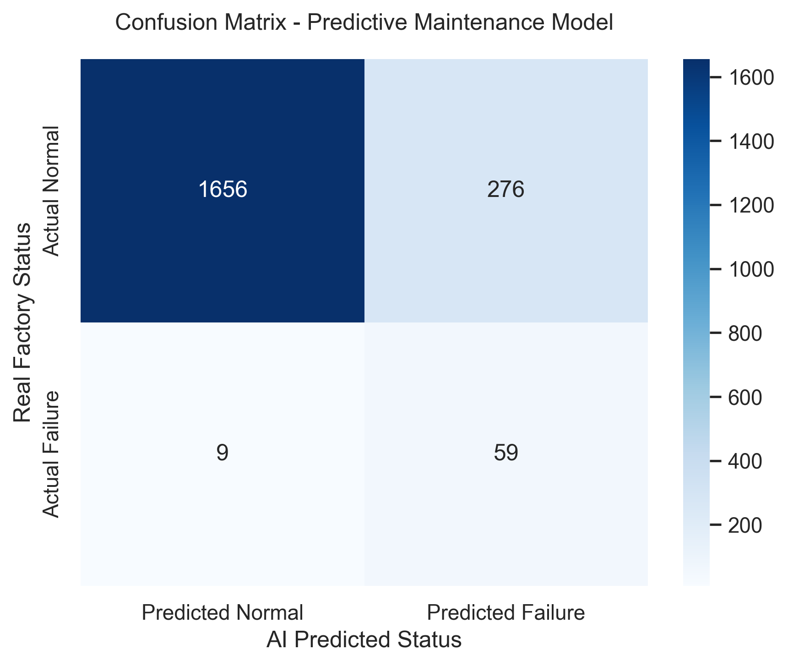

# 🏭 Industrial Failure Prediction: Predictive Maintenance with Machine Learning

[](https://python.org)
[](https://scikit-learn.org)

This project develops an end-to-end Machine Learning pipeline to predict catastrophic failures in an industrial machining process (CNC milling machine/lathe) using the **AI4I 2020 Predictive Maintenance Dataset**.

The core value of this project lies in fusing **mechanical engineering and physical domain knowledge** with AI algorithms to tackle the classic challenge of highly imbalanced data in industrial environments.

---

## 🛠️ Industrial Context & Data Dictionary

Unlike common tabular datasets, each row here does not represent a different machine. Instead, it captures **continuous time series snapshots of a single machine operating over time**. The tool wear (`tool_wear`) accumulates line by line while different raw materials (`Product ID`) enter and exit the manufacturing process.

### Analyzed Failure Modes (Scientific Baseline - S. Matzka)
*   **TWF (Tool Wear Failure):** Tool breakage or wear exceeding geometric tolerances.
*   **HDF (Heat Dissipation Failure):** Heat dissipation collapse. If $T_{process} - T_{ambient} < 8.6\text{ K}$ and the rotational speed is $< 1380\text{ rpm}$, the machine overheats.
*   **PWF (Power Failure):** Mechanical power stress ($Power = Torque \times Speed$). Occurs if the power drops below $3500\text{ W}$ or exceeds $9000\text{ W}$.
*   **OSF (Overstrain Failure):** Overload generated by the direct interaction between tool wear and torque.

---

## 🚀 Project Steps

### 1. Feature Engineering
Leveraging the thermodynamic and kinematic rules of the industrial process, we engineered two "artificial latent variables" to explicitly provide physical constraints to the model:
*   `temperature_difference`: The actual temperature gap ($\Delta T$).
*   `power_proxy`: An indicator of mechanical power stress ($Torque \times RPM$).

### 2. Preprocessing & Z-Score Scaling
Since the rotational speed operates in the thousands and torque in tens, we applied **Z-Score standardization** (`StandardScaler`). This avoided geometric dominance by larger scales and preserved *outliers*, which are vital predictors of impending failure.

<p align="center">
  
</p>

### 3. Stratified Splitting
Only **3.39%** of the instances in the dataset represent actual machine failures. To prevent the model from being blind to anomalies, we split the data into 80% Training and 20% Testing using **stratification** (`stratify=y`), forcing the exact same proportion of failures across both subsets.

---

## 📊 Results & The Engineer's Dilemma (Recall vs Precision)

Two distinct algorithms were evaluated to test the pipeline's robustness: a baseline **Logistic Regression** (with balanced class weights) and an advanced **Random Forest Classifier** (100 estimators).

### Performance Comparison (Test Dataset)


| Metric | Logistic Regression (Baseline) | Random Forest (Advanced) |
| :--- | :---: | :---: |
| **Global Accuracy** | 86.0% | 99.0% |
| **Precision (Failure Class)** | 18.0% | 96.0% |
| **Recall (Failure Class)** | **87.0%** | **66.0%** |
| **F1-Score (Failure Class)** | 0.30 | 0.78 |

#### Model 1: Logistic Regression (The "Paranoid Guard")
Generated **276 false alarms** but achieved an outstanding **Recall of 87%** (successfully catching 59 out of 68 actual failures).
<p align="center">
  
</p>

#### Model 2: Random Forest (The "Precise Specialist")
Skyrocketed the precision to **96%** (virtually zero false alarms), but its Recall dropped to **66%** (allowing more physical failures to pass unnoticed).

### ⚙️ Practical Engineering Conclusion
The choice of the final deployment model depends entirely on the factory's maintenance cost structure:
1.  **Choose Logistic Regression** if a machine failure is catastrophic (destroys equipment, causes days of downtime). The cost of sending a technician to check 276 false alarms is vastly lower than losing the asset.
2.  **Choose Random Forest** if stopping the machine for false alarms costs more than the physical maintenance or tool replacement itself.

---

## 📚 Dataset Source & Citations

The dataset used in this project was sourced from **Kaggle** and is based on a real-world industrial simulation model. 

If you use this dataset or project, please cite the original publication by **S. Matzka**:

> **Matzka, S.** "Explainable Artificial Intelligence for Predictive Maintenance Applications," *2020 Third International Conference on Artificial Intelligence for Industries (AI4I)*, 2020, pp. 69-74, doi: [10.1109/AI4I49448.2020.00023](https://doi.org).

*   **Kaggle Dataset Link:** [AI4I 2020 Predictive Maintenance Dataset](https://kaggle.com)

---

## 🛠️ How to Run This Project

1. Clone the repository:
   ```bash
   git clone https://github.com
   ```
2. Activate your virtual environment and install the required dependencies:
   ```bash
   pip install jupyter pandas numpy scikit-learn matplotlib seaborn
   ```
3. Launch Jupyter Notebook and open the file:
   ```bash
   jupyter notebook
   ```
4. Run all cells in `predictive_maintenance_study.ipynb`.
